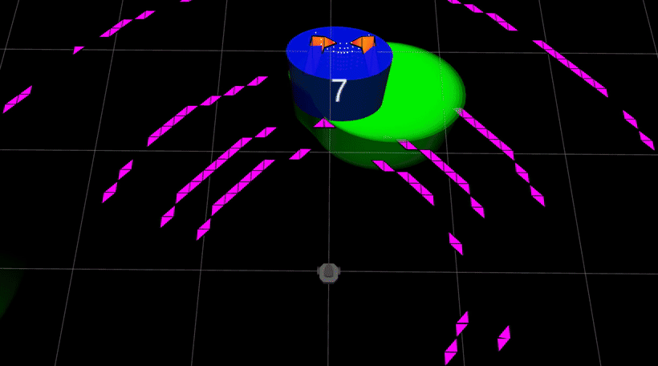
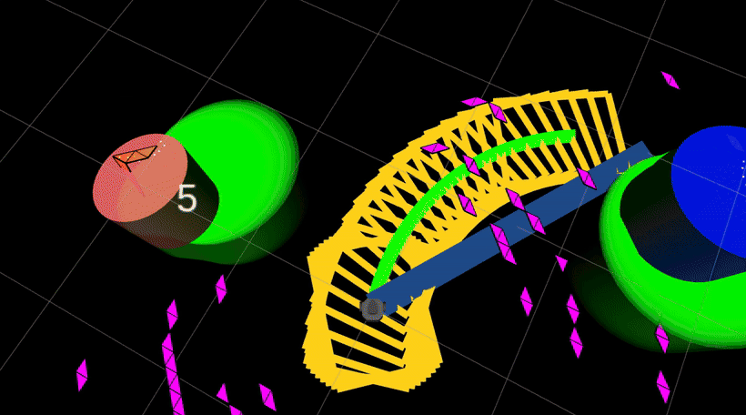
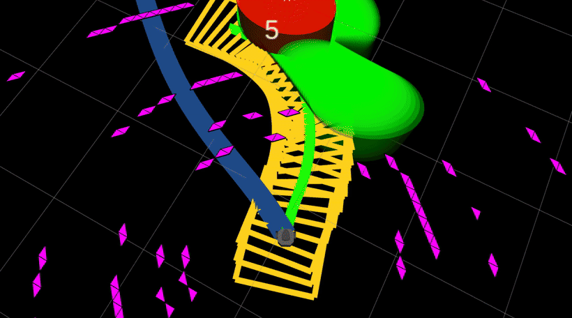
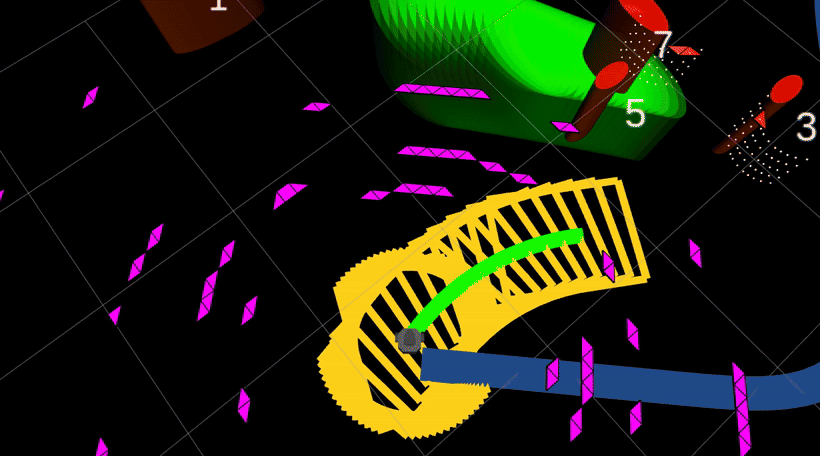

# DynaCBF-Planner


**动态障碍物避障局部规划器**：感知层从点云中实时提取障碍并预测其运动，规划层与控制层各司其职——

- **规划层**：环境由滑动占据栅格实时更新，路径搜索显式考虑机器人动力学，参考路径平滑、可直接执行；环境一变即高频重规划，没有先验地图也能边走边规划；
- **控制层**：非线性模型预测控制负责在速度与转向约束内最优跟踪参考路径；同时把每个障碍物的预测运动写成显式的安全约束（控制障碍函数），从理论上保证闭环轨迹不碰撞——面对移动障碍是提前、平滑地绕行，而不是临近了才急刹。

自带 Gazebo 场地，一条命令拉起全链路，在 RViz 里点目标即可驾驶。

> 来源、改动与第三方依赖声明见 [`NOTICE`](NOTICE)，许可证见 [`LICENSE`](LICENSE)。

## 效果演示

RViz 视角下的完整闭环：点目标 → 滑动栅格 + 动力学 A\* + B 样条规划 → 控制层跟踪避障，
途中对动/静态圆柱障碍实时感知、预测与绕行（画面中的椭圆为感知层拟合、跟踪层预测的障碍物）。

<table>
  <tr>
    <td align="center"></td>
    <td align="center"></td>
  </tr>
  <tr>
    <td align="center"></td>
    <td align="center"></td>
  </tr>
</table>

---

## 1. 从零跑起来

首次使用按 ① → ② → ③ 走一遍；**之后每次启动算法只需要第 ③ 步那几行。**

```bash
# ① 系统依赖（一次性，需要 sudo，由你本人执行）
sudo bash scripts/install_deps.sh

# ② 构建（本项目约定不使用 --symlink-install）
cd ~/ROBOT/DynaCBF-Planner        # 换成你自己的克隆路径
source /opt/ros/humble/setup.bash
colcon build --cmake-args -DCMAKE_BUILD_TYPE=Release
# 12 个包，全量约 2–3.5 分钟

# ③ 启动算法 ← 就是这几行，新开终端也能直接用
cd ~/ROBOT/DynaCBF-Planner        # 换成你自己的克隆路径
source /opt/ros/humble/setup.bash
source install/setup.bash
export TURTLEBOT3_MODEL=burger
ros2 launch dynacbf_bringup dynacbf.launch.py
```

也可以写成一行：

```bash
cd ~/ROBOT/DynaCBF-Planner && source /opt/ros/humble/setup.bash && source install/setup.bash && export TURTLEBOT3_MODEL=burger && ros2 launch dynacbf_bringup dynacbf.launch.py
```

第 ③ 步会拉起 13 个进程：Gazebo 服务端、RViz、感知、跟踪、规划、控制层三个节点、
机器人本体等。**Gazebo 只有服务端（不弹 Gazebo 窗口），RViz 窗口会自动打开。**

启动后约 10–20 秒才就绪：这段时间 Gazebo 在载入场地、生成机器人、启动雷达，
日志里会反复出现 `wait for lidar`，属正常。**等 RViz 里能看到机器人和点云再操作。**

**停止**：在运行 launch 的终端按 `Ctrl-C`。

---

## 2. 怎么用（在 RViz 里点目标）

1. 确认 RViz 左侧 `Fixed Frame` 是 **world**，且机器人模型、点云已经显示出来
2. 点工具栏的 **2D Goal Pose**
3. 在地图上点一下（可以按住拖出朝向）→ 规划器立即规划，机器人开过去；途中有动态障碍会自动绕行
4. 想让它继续走，就再点一个新目标

> 工具栏另外两个按钮 **2D Pose Estimate** 和 **Publish Point** 在当前链路里没有订阅者，
> 点了不会有反应，不用管它们。

### 怎么判断它工作正常

| 看哪里 | 正常表现 |
|---|---|
| RViz 显示项 | `/global_path`（参考路径）、`/ellipse_vis`（障碍椭圆）、`/local_pcd`（点云）持续刷新 |
| RViz 3D 视图 | 机器人在动；障碍椭圆随圆柱移动 |
| 运行 launch 的终端 | 反复出现 `find feasible solution`（控制器解算成功）与 `final_plan_success=1`（规划成功） |
| RViz 里机器人 | 接近目标后停下（到位阈值 0.1 m） |

偶发出现 `MPC solve failed ... Infeasible_Problem_Detected` 或 `fail to find feasible solution` 是正常的：
此时控制器按设计输出**零速**停车，下一个周期通常自行恢复。

---

## 3. 常用跑法

| 想做什么 | 命令 |
|---|---|
| 默认：RViz 手动点目标 | `ros2 launch dynacbf_bringup dynacbf.launch.py` |
| 不用 RViz，按预设航点自动跑 | `ros2 launch dynacbf_bringup dynacbf.launch.py rviz:=false navi_mode:=2` |
| 还想看 Gazebo 窗口 | `ros2 launch dynacbf_bringup dynacbf.launch.py gui:=true` |
| 换场地（例如无障碍对照场景） | `ros2 launch dynacbf_bringup dynacbf.launch.py world:=$(pwd)/src/dynacbf_simulator/worlds/world_empty.world` |
| 换一组预设航点 | `ros2 launch dynacbf_bringup dynacbf.launch.py navi_mode:=2 keypoints_file:=/绝对路径/你的.yaml` |

### launch 参数

| 参数 | 默认 | 说明 |
|---|---|---|
| `navi_mode` | `1` | `1`=等 RViz 的 2D Goal Pose；`2`=按预设航点自动开跑；`3`=reference_path |
| `rviz` | `true` | 是否启动 RViz |
| `gui` | `false` | 是否启动 Gazebo 图形客户端（服务端始终启动，仿真必需） |
| `world` | `world1.world` | 场地文件 |
| `keypoints_file` | `dynacbf_planner/config/keypoints.demo.yaml` | 仅 `navi_mode:=2` 使用 |
| `use_sim_time` | `true` | 只传给 `robot_state_publisher` |

可选场地（`src/dynacbf_simulator/worlds/`）：`world1.world`（默认，5 个圆柱）、
`world0.world`（5 个圆柱）、`world.world`（上游原版，8 个圆柱）、
`world_empty.world`（无障碍对照场景，用于单独验证规划/控制链路）。

> `navi_mode=1` 时**第一个目标会被里程计门控**：要等第一帧位姿到达后才接受目标。

---

## 4. 改参数改在哪里

> **重要**：本项目不使用 `--symlink-install`，`install/` 里放的是配置文件的**副本**。
> 改了 `src/**/config/*.yaml` **必须重新构建**，否则运行时读到的还是旧值：
> ```bash
> colcon build --packages-select <包名>   # 或 colcon build 全量
> ```

| 想调什么 | 改哪个文件 | 键 |
|---|---|---|
| 最大前进速度 / 转向速度 | `src/dynacbf_dcbf/config/dcbf_params.yaml` | `v_max` / `omega_max` |
| 避障余量（离椭圆**边界**的净空） | 同上 | `safe_dist` |
| 控制障碍函数保守程度 | 同上 | `gamma_k` |
| 是否启用 CBF 约束 | 同上 | `MPC_constraint`: `CBF` / `Euclidean` / `None` |
| 预测时域 | 同上 | `MPC_N`、`MPC_step_size`、`kalman_N`（**三者必须同步**，且 `kalman_N` 必须等于 `MPC_N`） |
| 参考路径点间距（决定隐含参考速度） | 同上 | `arc_step`（`0.1` m 对应约 `0.4` m/s） |
| 规划视界 / 重规划触发距离 | `src/dynacbf_planner/config/planner.yaml` | `fsm.planning_horizon` / `fsm.thresh_replan` |
| 地图分辨率、范围、射线长度 | 同上 | `grid_map.resolution` / `grid_map.sliding_map_size_*` / `grid_map.max_ray_length` |
| 感知范围与聚类门限 | `src/dynacbf_perception/config/config.yaml` | `localmap_x_size`、`localmap_y_size`、`DBSCAN_R`、`DBSCAN_N` |
| 地面回波过滤高度 | 同上 | `min_pass_z`（必须**小于**雷达安装高度 0.172 m） |
| 障碍物数量与运动速度 | `src/dynacbf_simulator/config/config.yaml` | `cylinder_num` 与各 `x_i / y_i / vx_i / vy_i` |
| 预设航点 | `src/dynacbf_planner/config/keypoints.demo.yaml` | `fsm.waypoints`（每三个数一个 `x, y, z`） |

---

## 5. 不正常时按这个顺序查

| 现象 | 原因与处理 |
|---|---|
| 点了目标机器人不动，终端也没有规划日志 | TF `world → base_link` 不完整。`controller_node` 缺这条 TF 时会**静默**跳过、不发 `/curr_state`，控制器就完全不动。检查：`ros2 run tf2_tools view_frames` 或看 `ros2 topic hz /curr_state` 是否有数据 |
| 规划器日志一直 `wait for goal` | `navi_mode` 是 1 而你没点目标；或用了 `navi_mode:=2` 但航点文件没被读到 |
| RViz 报 `unable to open display ":0"` | WSLg 的 X11 socket 目录缺失，执行 `ln -sfn /mnt/wslg/.X11-unix /tmp/.X11-unix` 后重试 |
| RViz 里看不到障碍椭圆 | 雷达还没出点（Gazebo 启动后需 5–20 秒）；确认 `ros2 topic hz /velodyne_points` 有数据 |
| 好不容易看到机器人但地图里"处处是障碍"、规划老是失败 | 地面回波没滤掉。确认 `src/dynacbf_perception/config/config.yaml` 的 `min_pass_z` 生效（且小于雷达安装高度），并**重新构建**该包 |
| 障碍不移动 | 障碍由 `move_test` 按 `config.yaml` 推动，且需要控制器发出 `/cmd_move`。自动航点模式最容易观察 |

---

## 6. 它由什么组成

| 包 | 干什么 | 产物 |
|---|---|---|
| `dynacbf_perception` | 点云地面过滤 → DBSCAN 聚类 → 最小包围椭圆 | `local_map` |
| `dynacbf_tracking` | 数据关联 + 常速度 Kalman → 未来 25 步椭圆预测 | `obs_kf` |
| `dynacbf_planner` | 滑动栅格 → 射线投射 → 动力学 A\* → B 样条优化 → 重规划状态机 | `dynacbf_planner_node` |
| `dynacbf_dcbf` | 把 B 样条按弧长采样成几何路径；非线性模型预测控制 + 椭圆控制障碍函数求解；发指令 | `bspline_path_sampler`、`local_planner_node`、`controller_node` |
| `dynacbf_simulator` | 真值里程计、动态障碍物推动、场地与世界文件 | `pseudo_odom`、`move_test` |
| `dynacbf_msgs` | 接口定义（8 个 `.msg`） | — |
| `dynacbf_bringup` | 唯一的启动入口（跨包编排） | `dynacbf.launch.py` |
| `src/3rdparty/` | turtlebot3 模型与 velodyne VLP-16 插件 | — |

### 数据链

```
Gazebo 场地 → /velodyne_points → local_map → /for_obs_track → obs_kf → /obs_predict_pub
  → dynacbf_planner_node → /planning/bspline → bspline_path_sampler → /global_path
  → local_planner_node → /local_plan → controller_node → /cmd_vel → 底盘
```

### 主要话题（RViz 与排障时用得到）

| 话题 | 类型 | 谁发 |
|---|---|---|
| `/velodyne_points` | `PointCloud2` | Gazebo 雷达插件 |
| `/local_pcd` | `PointCloud2` | `local_map`（已滤地面） |
| `/ellipse_vis` | `MarkerArray` | `local_map`（障碍椭圆） |
| `/obs_predict_vis_pub` | `MarkerArray` | `obs_kf`（椭圆预测可视化） |
| `/base_pose_ground_truth` | `Odometry` | `pseudo_odom`（真值里程计） |
| `/planning/bspline` | `dynacbf_msgs/Bspline` | 规划器（带时间的 B 样条） |
| `/global_path` | `Path` | `bspline_path_sampler`（控制器的参考路径） |
| `/local_plan` | `Float32MultiArray` | `local_planner_node`（MPC 解） |
| `/curr_state` | `Float32MultiArray` | `controller_node` |
| `/cmd_vel` | `Twist` | `controller_node`（最终底盘指令） |
| `/move_base_simple/goal` | `PoseStamped` | RViz 的 2D Goal Pose |

坐标系：`world → odom`（静态单位变换）→ `base_footprint`（Gazebo diff_drive 插件）
→ `base_link`（`robot_state_publisher`）；机器人出生在原点 `(0, 0)`。RViz 固定坐标系用 `world`。

---

## 7. 当前状态

- 12 个包（7 个自有 + 5 个第三方）干净构建通过，退出码 0。
- 闭环已实跑验证：自动航点模式下机器人从 `x=0.02 m` 走到 `x=2.17 m`，全程持续绕障重规划；
  RViz 手动点目标模式已验证可正常导航避障。
- 单次模型预测控制求解耗时约 0.2–2.2 s（与机器负载相关），高于配置的 `replan_period=0.1 s`，
  实际重规划频率约 1–1.5 Hz。
- 尚未建立量化指标工具与自动化回归：单元测试已注册但需手动运行
  （`colcon test --packages-select dynacbf_planner && colcon test-result --verbose`）。
